<h1 align="center">
   

  
  ##               Vultaik is a 2D/3D toy engine implemented in [Vulkan®]([https://www.khronos.org/vulkan/](https://learn.microsoft.com/en-us/windows/win32/direct3d12/directx-12-programming-guide))
  
</h1>

  ##              

## Overview
This toy engine is designed for the Vulkan learning process, I mainly use it to experiment with graphical or computing techniques and should not be used as a cerium product as it may have memory leaks and faulty or poorly optimized implementations.

## Low-level rendering backend
The rendering backend focuses entirely on Vulkan, so it reuses Vulkan enums and data structures where appropriate. However, the API greatly simplifies the more painful points of writing straight Vulkan. It's not designed to be the fastest renderer ever made, it's likely a happy middle ground between "perfect" Vulkan and OpenGL/D3D11 w.r.t. CPU overhead.

## Examples

Example | Details
---------|--------
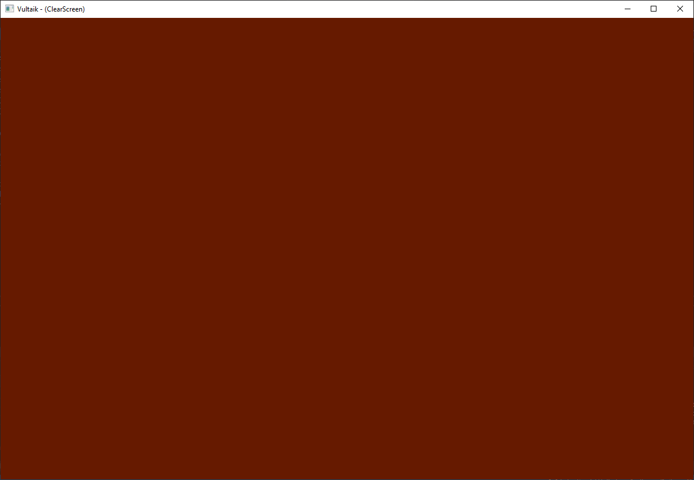 | [Clear Screen](Src/Samples/Samples/ClearScreen/ClearScreen.cs)  This example shows how to configure the device and clear the color.
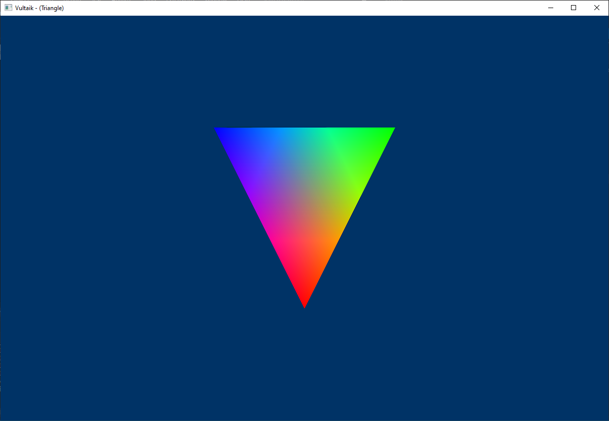 | [Triangle](Src/Samples/Samples/Triangle/Triangle.cs)  This example shows how to render simple triangle.
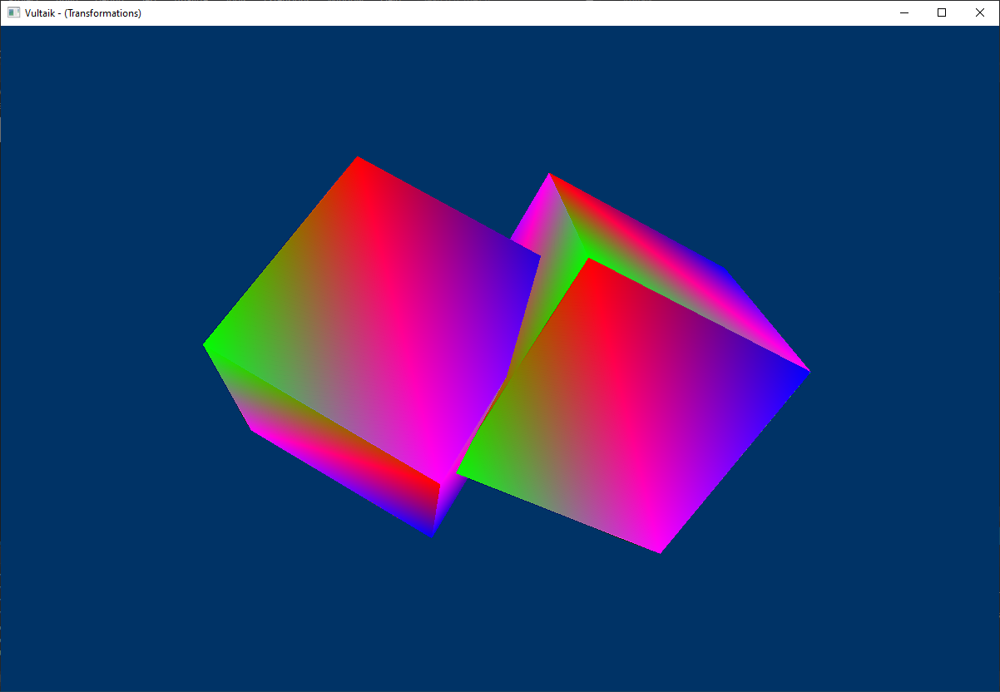 | [Transformations](Src/Samples/Samples/Transformations/Transformations.cs)  This example how to transform the world space for each object.
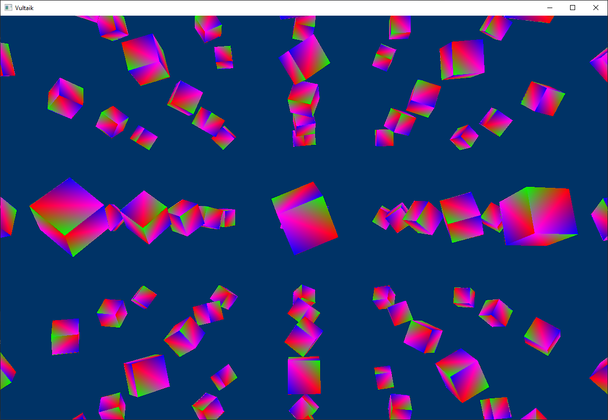 | [Push Constant](Src/Samples/Samples/PushConstant/PushConstant.cs)  This example use push constants, small blocks of uniform data stored within a command buffer, to pass data to a shader without the need for uniform buffers.
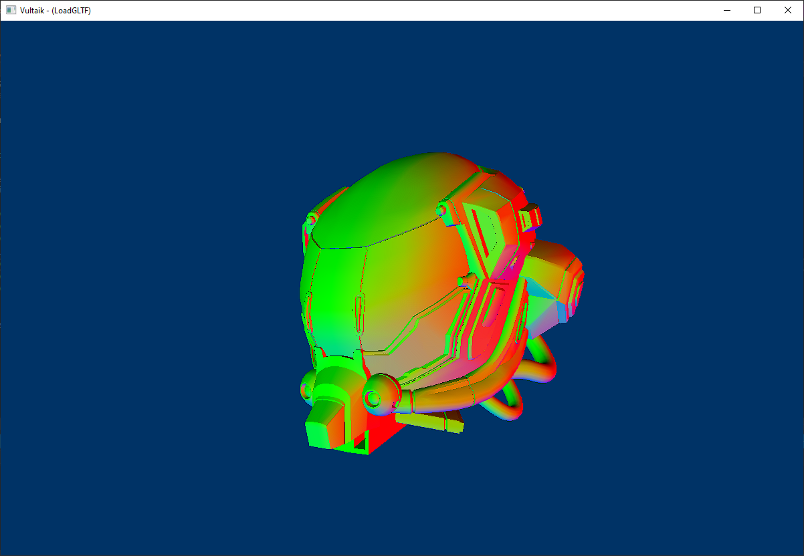 | [Load GLTF](Src/Samples/Samples/LoadGLTF/LoadGLTF.cs)  This example shows how to load GLTF models.
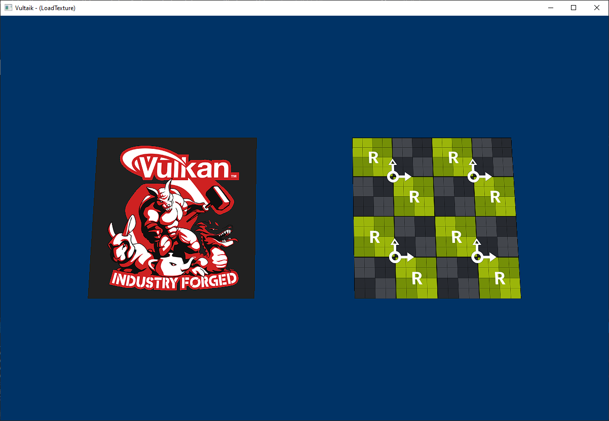 | [Load Texture](Src/Samples/Samples/LoadTexture/LoadTexture.cs)  This example shows how to load 2D texture from disk (including all mip levels). 
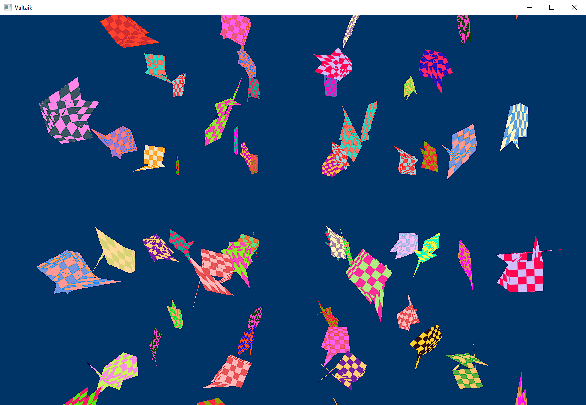 | [Bindless](Src/Samples/Samples/Bindless/Bindless.cs)  This example demonstrates the use of VK_EXT_descriptor_indexing for creating descriptor sets with a variable size that can be dynamically indexed in a shader using `SPV_EXT_descriptor_indexing`.
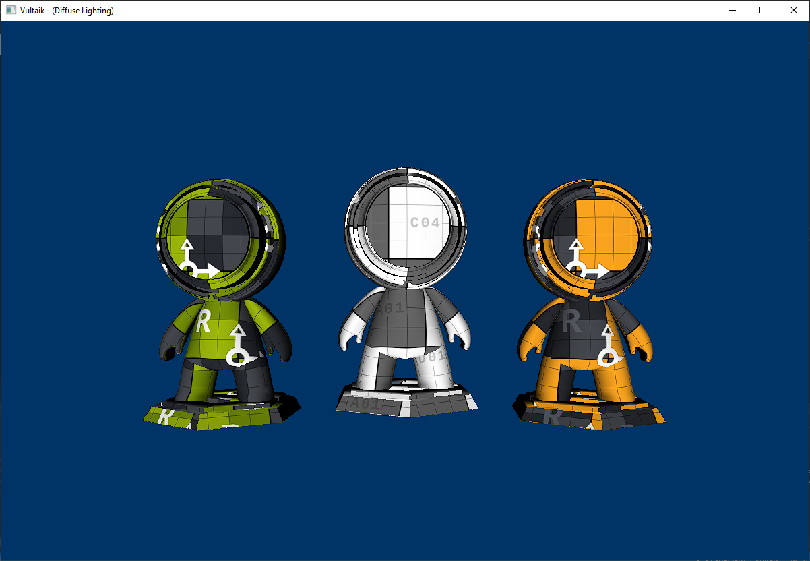 | [Diffuse Lighting](Src/Samples/Samples/Lighting/Lighting.cs)  This example shows how to create diffuse lighting. 
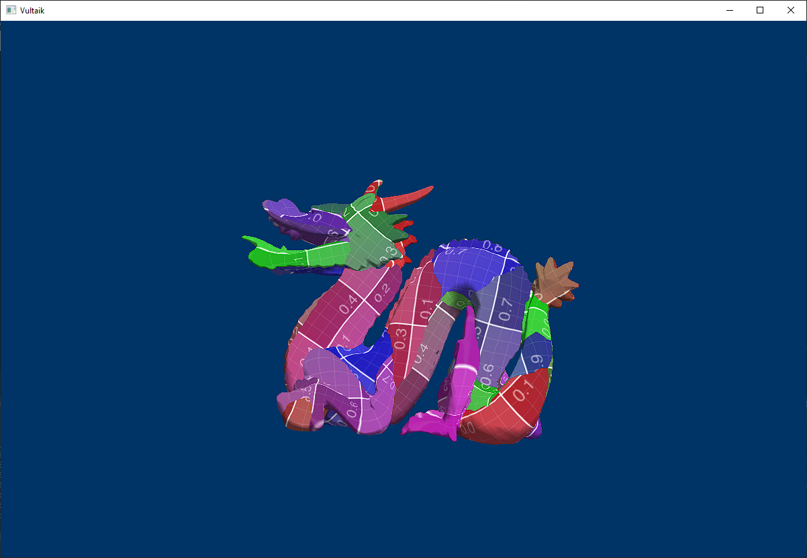 | [Ambient Lighting](Src/Samples/Samples/AmbientLighting/AmbientLighting.cs)  This example shows how to create ambient lighting. 
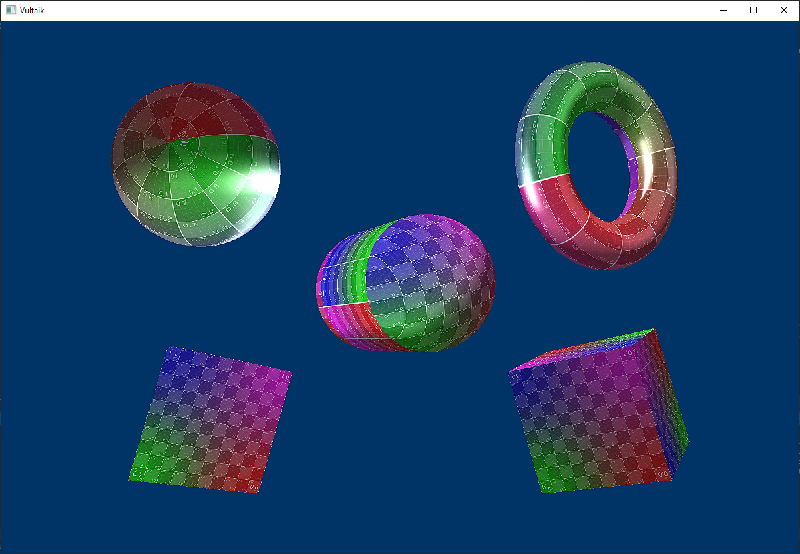 | [Specular Lighting](Src/Samples/Samples/SpecularLighting/SpecularLighting.cs)  This example shows how to create specular lighting. 
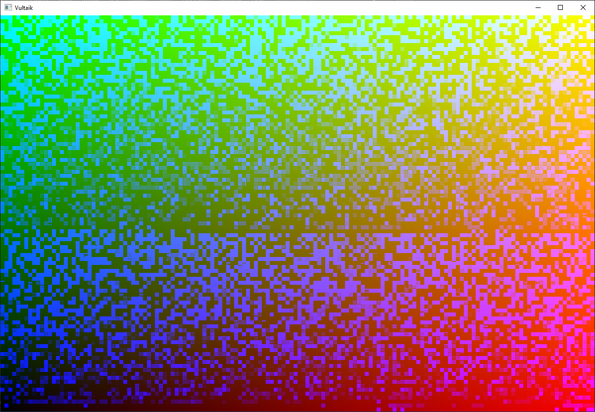 | [Compute Texture](Src/Samples/Samples/SpecularLighting/ComputeTexture.cs)  Use a calculation shader in conjunction with a separate calculation queue to modify a full screen image.

 

 

The code is licensed under MIT. Feel free to use it for whatever purpose.
